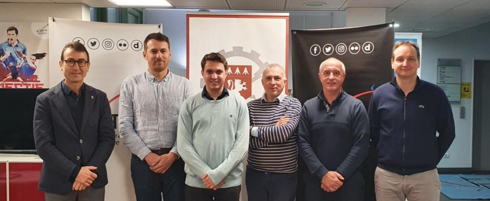
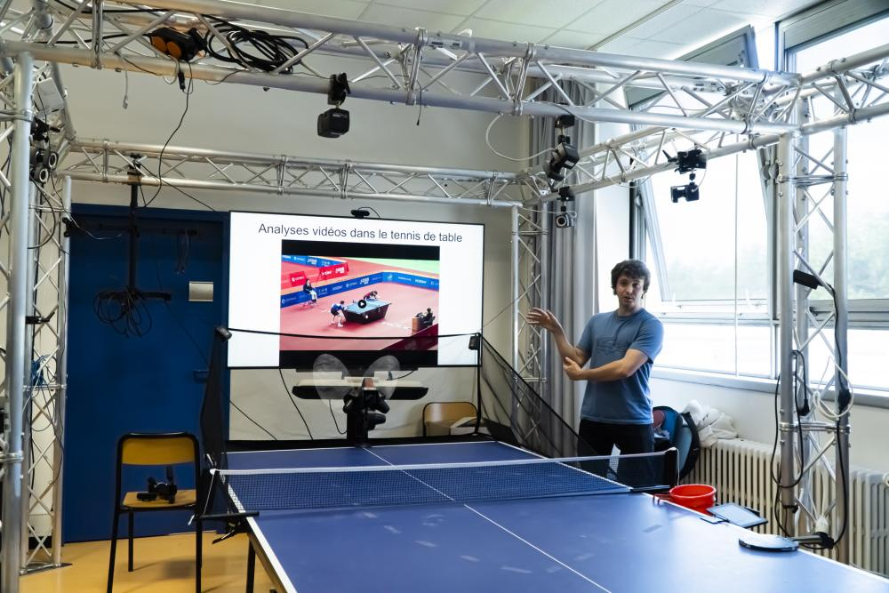

# Table Tennis Research 

Contact: romain.vuillemot@ec-lyon.fr

## What do we do?

We are a team of researchers at [Centrale Lyon](https://www.ec-lyon.fr/) and [LIRIS](https://liris.cnrs.fr/) Laboratory working on sports data analysis to improve athletes performances. We focus on various sports, from swimming to table tennis, in close collaboration with athletes and coaches. We leverage existing data science, computer vision, and data visualization techniques to extract insights from data, in particular our approach is the following:

- **Data Collection**: We gather data from various sources, with a focus  on video footage, but also experiment / benchmark tracking devices (e.g. Motion capture, IMUs) and publicly available datasets.
- **Exploratory Data Analysis**: We calculate and visualize exploratory statistics, data distributions to create visual dashboard so we can better grasp the collected data properties (and quality) to create models and new statistics.
- **Data Visualization**: We also build custom, advanced visualizations to help us understand complex data patterns and trends from collected data and statistics. We also use visualization to communicate our findings to athletes and coaches.

As a research group ou activity is centered as follows:

- **Publishing** research academic publications in sports-specific venues (eg MLSA workshop) but also general Vis/HCI (IEEE Vis, EuroGraphics, CHI).
- **Developing** tools and methods for data collection and analysis.
- **Collaborating** with other researchers and institutions in the field of sports analytics.
- **Disseminating** our findings through conferences, workshops, and online platforms.

<figure>
  

    &nbsp;
    
  

  <figcaption style="text-align: center; font-style: italic; margin-top: 8px;">
    Fête de la science and a working session with students at Centrale Lyon.
  </figcaption>
</figure>

## People

- [Romain Vuillemot](mailto:romain.vuillemot@ec-lyon.fr) (Assistant professor, Centrale Lyon, LIRIS)
- Aymeric Erades (PhD student, Centrale Lyon, LIRIS)

*Students:* Lou Peuch, Thomas Papon, Guillaume Boitard, Farouk Miled, Gabin Calment, Hamdi Sokma, Huanyu Qu, Emmanuel Minois-Genin, Pierre Duluard, Eymeric Chauchat, Xinqing Li (more to come)

*Collaborators:* Pierre Ripoll, Sylvain Lesage.

*External Collaborators:* Marc Plantevit, Céline Robardet, Pierre-Etienne Martin, Anais Servais, Christophe Hurter.

## Publications

Aymeric Erades, Romain Vuillemot. *Player-Centric Shot Maps in Table Tennis.* Computer Graphics Forum, 2025, pp.10. 

## Tools

In general see [our tools repository](https://github.com/centralelyon/):

- [Table Tennis Serves](https://github.com/centralelyon/table-tennis-serves): A tool to analyze table tennis serves.
- [Table Tennis Returns](https://github.com/centralelyon/table-tennis-returns): A tool to analyze table tennis returns.
- [Table Tennis Analytics](https://github.com/centralelyon/table-tennis-analytics): Game metrics and statistics for table tennis.

Investigating Control Areas in Table Tennis

Player‐Centric Shot Maps in Table Tennis

SportsVideo: A Multimedia Dataset for Sports Event and Position Detection in Table Tennis and Swimming

Visual Analysis of Table Tennis Game Tactics

Discovering and visualizing tactics in a table tennis game based on subgroup discovery

## Talks

- Conférence Sciences 2024 (8 juin 2023 à Lyon)
- Journée Visu 2023 (le 22 juin 2023, à Orsay) 
- Ecole d'été Sciences 2024 

## Press

<figure>
  

    &nbsp;
    
  

  <figcaption style="text-align: center; font-style: italic; margin-top: 8px;">
    Fête de la science and a working session with students at Centrale Lyon.
  </figcaption>
</figure>

FFTT : L'école Centrale de Lyon et la Fédération Française de Tennis de Table signent une convention de partenariat [https://www.fftt.com/site/actualites/2024-02-15/l-ecole-centrale-de-lyon-et-federation-francaise-de-tennis-de-table-signent-convention-de-partenariat](https://www.fftt.com/site/actualites/2024-02-15/l-ecole-centrale-de-lyon-et-federation-francaise-de-tennis-de-table-signent-convention-de-partenariat)

JO : des athlètes performent grâce aux chercheurs de l’École centrale de Lyon: [https://www.leprogres.fr/science-et-technologie/2024/09/07/jo-des-athletes-performent-grace-aux-chercheurs-de-l-ecole-centrale-de-lyon](https://www.leprogres.fr/science-et-technologie/2024/09/07/jo-des-athletes-performent-grace-aux-chercheurs-de-l-ecole-centrale-de-lyon)

Un doctorant de l'ECL et du laboratoire LIRIS-CNRS aux côtés de l'équipe de France de tennis de table: [https://www.centraliens-lyon.net/technica/article/jo-paris-2024-un-doctorant-de-l-ecl-et-du-laboratoire-liris-cnrs-aux-cotes-de-l-equipe-de-france-de-tennis-de-table/487](https://www.centraliens-lyon.net/technica/article/jo-paris-2024-un-doctorant-de-l-ecl-et-du-laboratoire-liris-cnrs-aux-cotes-de-l-equipe-de-france-de-tennis-de-table/487)

Accompagner l'équipe de France de tennis de table dans sa quête de médaille grâce à l'IA: [https://www.ec-lyon.fr/centrale-lyon/actualites/jo-2024-accompagner-lequipe-de-france-de-tennis-de-table-dans-sa-quete-de-medaille-grace-lia](https://www.ec-lyon.fr/centrale-lyon/actualites/jo-2024-accompagner-lequipe-de-france-de-tennis-de-table-dans-sa-quete-de-medaille-grace-lia)

Chronique RCF Lyon L'intelligence artificielle au service de l'équipe de France de tennis de table [https://www.rcf.fr/economie-et-societe/dis-pourquoi-rcf-lyon?episode=379406](https://www.rcf.fr/economie-et-societe/dis-pourquoi-rcf-lyon?episode=379406)