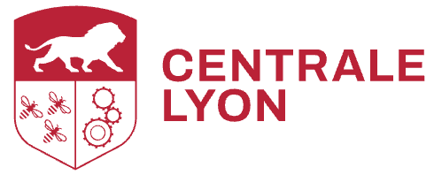

# Table Tennis Research 

Contact: [romain.vuillemot@ec-lyon.fr](mailto:romain.vuillemot@ec-lyon.fr)

## What do we do?

We are a team of researchers at [Centrale Lyon](https://www.ec-lyon.fr/) (Engineering School) and [LIRIS](https://liris.cnrs.fr/) (Reaserch Laboratory) working on sports data analysis and visualization to improve athletes performances. We focus on various sports, from swimming to table tennis, in close collaboration with athletes and coaches. Our approach is the following:

- **Data Collection** - we gather data from various sources, with a focus  on video footage, but also experiment / benchmark tracking devices (e.g. Motion capture, IMUs) and publicly available datasets.
- **Exploratory Data Analysis** - we calculate and visualize exploratory statistics, data distributions to create visual dashboard so we can better grasp the collected data properties (and quality) to create models and new statistics.
- **Data Visualization** - we also build custom, advanced visualizations to help us understand complex data patterns and trends from collected data and statistics. We also use visualization to communicate our findings to athletes and coaches.

As a research group our activity is centered as follows:

- **Publishing** research academic publications in sports-specific venues (eg MLSA workshop) but also general Vis/HCI (IEEE Vis, EuroGraphics, CHI).
- **Developing** tools and methods for data collection and analysis.
- **Collaborating** with other researchers and institutions in the field of sports analytics.
- **Disseminating** our findings through conferences, workshops, and online platforms.

<figure>
  

    &nbsp;
    
  

  <figcaption style="text-align: center; font-style: italic; margin-top: 8px;">
    Fête de la science and a working session with students at Centrale Lyon.
  </figcaption>
</figure>

## People

Principal Investigator: [Romain Vuillemot](mailto:romain.vuillemot@ec-lyon.fr) (Assistant professor, Centrale Lyon, LIRIS)

Team Members:
- Aymeric Erades (PhD student, Centrale Lyon, LIRIS)

*Collaborators:* Pierre Ripoll, Sylvain Lesage.

*External Collaborators:* Marc Plantevit, Céline Robardet, Pierre-Etienne Martin, Anais Servais, Christophe Hurter.

## Publications

Riad Attou, Marin Mathé, Aymeric Eradès, Romain Vuillemot. **Analysis of Service Returns in Table Tennis** 12th Workshop on Machine Learning and Data Mining for Sports Analytics (ECML/PKDD 2025), Sep 2025, Porto, Portugal. 

Aymeric Erades, Romain Vuillemot. **Player-Centric Shot Maps in Table Tennis.** Computer Graphics Forum, 2025, pp.10. 

Aymeric Erades, Lou Peuch, Romain Vuillemot. **Investigating Control Areas in Table Tennis.** Sixteenth International EuroVis Workshop on Visual Analytics (EuroVA), Jun 2025, Luxembourg, France. 

Aymeric Erades, Thomas Papon, Romain Vuillemot. **Characterizing Serves in Table Tennis**. Machine Learning and Data Mining for Sports Analytics, Sep 2024, Vilnius (Lituanie), Lithuania. 

Aymeric Erades, Anais Servais, Christophe Hurter, Romain Vuillemot. **Un design space de vidéos augmentées de matches de tennis de table**. Journée Visu, 2024. 

Aymeric Erades, Pierre-Etienne Martin, Romain Vuillemot, Boris Mansencal, Renaud Péteri, Julien Morlier, Stefan Duffner, Jenny Benois-Pineau. **SportsVideo: A Multimedia Dataset for Sports Event and Position Detection in Table Tennis and Swimming.** MediaEval 2023 Workshop collocated with MMM 2024, Feb 2024, Amsterdam, Netherlands. 

Gabin Calmet, Aymeric Erades, Romain Vuillemot. **Exploring Table Tennis Analytics: Domination, Expected Score and Shot Diversity.** Machine Learning and Data Mining for Sports Analytics, Sep 2023, Turin, Italy. 

Aymeric Erades, Romain Vuillemot. **Visual Analysis of Table Tennis Game Tactics.**
Journée VISU 2023. 

Pierre Duluard, Xinqing Li, Marc Plantevit, Céline Robardet, Romain Vuillemot. **Discovering and Visualizing Tactics in a Table Tennis Game Based on Subgroup Discovery.**  ECML/PKDD 2022 Workshop, Grenoble, France, 2022. 

## Code and Data

Code: in general see [our tools repository](https://github.com/centralelyon/):

- [Table Tennis Serves](https://github.com/centralelyon/table-tennis-services): A tool to analyze table tennis serves.

- [Table Tennis Returns](https://github.com/centralelyon/table-tennis-returns): A tool to analyze table tennis returns.

- [Table Tennis Analytics](https://github.com/centralelyon/table-tennis-analytics): Game metrics and statistics for table tennis.

- [Investigating Control Areas in Table Tennis](https://github.com/centralelyon/table-tennis-control-areas): A tool to analyze control areas in table tennis.

- [Player‐Centric Shot Maps in Table Tennis](https://github.com/centralelyon/player-centric-shot-maps): A tool to analyze bounce positions in relation to player positions.

- [SportsVideo: A Multimedia Dataset for Sports Event and Position Detection in Table Tennis and Swimming](https://github.com/centralelyon/SportsVideo)

- [Visual Analysis of Table Tennis Game Tactics](https://github.com/centralelyon/table-tennis-analytics)

- [Virtual reality to explore table tennis data](https://github.com/AmigoCap/AnalyseTT) in [Amigo Platform](https://amigocap.github.io/)

- Discovering and visualizing tactics in a table tennis game based on subgroup discovery 

Data:

- [SportsVideo: A Multimedia Dataset for Sports Event and Position Detection in Table Tennis and Swimming](https://github.com/centralelyon/sportsvideo) part of the [MediaEval 2023 challenge](https://multimediaeval.github.io/editions/2023/tasks/sportsvideo/)

## Talks

- EuroVis 2025 (June 2025, Luxembourg) [https://eurovis2025.eu/](https://eurovis2025.eu/)
- EuroVA 2025 (June 2025, Luxembourg) [https://x.com/euro_va/status/1929559822128619915](https://x.com/euro_va/status/1929559822128619915)
- Challenge Sciences 2024 (8 juin 2023 à Lyon) [https://clm202423.sciencesconf.org/](https://clm202423.sciencesconf.org/)
- Journée Visu 2023 (le 22 juin 2023, à Orsay) [https://journee-visu.github.io/2023/](https://journee-visu.github.io/2023/)
- Ecole d'été 2023 [https://sciences2024-2e2.sciencesconf.org/program](https://sciences2024-2e2.sciencesconf.org/program)
- Ecole d'été 2025 [https://2e4.sciencesconf.org/](https://2e4.sciencesconf.org/)
- Pint of Science 2024 (le 21 mai 2024, à Lyon) [https://pintofscience.fr/event/quand-la-science-performe-aux-jeux-olympiques](https://pintofscience.fr/event/quand-la-science-performe-aux-jeux-olympiques)

## Press Coverage

<figure>
  

    &nbsp;
    
  

  <figcaption style="text-align: center; font-style: italic; margin-top: 8px;">
    Meeting at FFT headquarters and demo in Salle Amigo at Centrale Lyon.
  </figcaption>
</figure>

FFTT : L'école Centrale de Lyon et la Fédération Française de Tennis de Table signent une convention de partenariat [https://www.fftt.com/site/actualites/2024-02-15/l-ecole-centrale-de-lyon-et-federation-francaise-de-tennis-de-table-signent-convention-de-partenariat](https://www.fftt.com/site/actualites/2024-02-15/l-ecole-centrale-de-lyon-et-federation-francaise-de-tennis-de-table-signent-convention-de-partenariat)

JO : des athlètes performent grâce aux chercheurs de l’École centrale de Lyon: [https://www.leprogres.fr/science-et-technologie/2024/09/07/jo-des-athletes-performent-grace-aux-chercheurs-de-l-ecole-centrale-de-lyon](https://www.leprogres.fr/science-et-technologie/2024/09/07/jo-des-athletes-performent-grace-aux-chercheurs-de-l-ecole-centrale-de-lyon)

Un doctorant de l'ECL et du laboratoire LIRIS-CNRS aux côtés de l'équipe de France de tennis de table: [https://www.centraliens-lyon.net/technica/article/jo-paris-2024-un-doctorant-de-l-ecl-et-du-laboratoire-liris-cnrs-aux-cotes-de-l-equipe-de-france-de-tennis-de-table/487](https://www.centraliens-lyon.net/technica/article/jo-paris-2024-un-doctorant-de-l-ecl-et-du-laboratoire-liris-cnrs-aux-cotes-de-l-equipe-de-france-de-tennis-de-table/487)

JO Paris 2024 : un doctorant de l’ECL et du laboratoire LIRIS CNRS aux côtés de l’Équipe de France de Tennis de Table [https://www.technica-magazine.fr/technica/article/ jo-paris-2024-un-doctorant-de-l-ecl-et-du-laboratoire-liris-cnrs-aux-cotes-de-l-equipe-de-france-de-tennis-de-table/487](https://www.technica-magazine.fr/technica/article/jo-paris-2024-un-doctorant-de-l-ecl-et-du-laboratoire-liris-cnrs-aux-cotes-de-l-equipe-de-france-de-tennis-de-table/487)

Accompagner l'équipe de France de tennis de table dans sa quête de médaille grâce à l'IA: [https://www.ec-lyon.fr/centrale-lyon/actualites/jo-2024-accompagner-lequipe-de-france-de-tennis-de-table-dans-sa-quete-de-medaille-grace-lia](https://www.ec-lyon.fr/centrale-lyon/actualites/jo-2024-accompagner-lequipe-de-france-de-tennis-de-table-dans-sa-quete-de-medaille-grace-lia)

Chronique RCF Lyon L'intelligence artificielle au service de l'équipe de France de tennis de table [https://www.rcf.fr/economie-et-societe/dis-pourquoi-rcf-lyon?episode=379406](https://www.rcf.fr/economie-et-societe/dis-pourquoi-rcf-lyon?episode=379406)

L'analyse vidéo, la nouvelle arme des pongistes bleus à l'approche des JO de Paris.
[https://www.lequipe.fr/Tennis-de-table/Article/L-analyse-video-la-nouvelle-arme-des-pongistes-bleus-a-l-approche-des-jo-de-paris/1448752](https://www.lequipe.fr/Tennis-de-table/Article/L-analyse-video-la-nouvelle-arme-des-pongistes-bleus-a-l-approche-des-jo-de-paris/1448752)

La technique et la compétition:
[https://www.eniseen.com/news/la-technique-et-la-competition-1978](https://www.eniseen.com/news/la-technique-et-la-competition-1978)

Aymeric Erades et Félix Lebrun
[https://aspctt.com/2024/08/08/aymeric-et-felix/](https://aspctt.com/2024/08/08/aymeric-et-felix/)

La science au service de la performance sportive: [https://www.polytechnique-insights.com/tribunes/science/la-science-au-service-de-la-performance-sportive/](https://www.polytechnique-insights.com/tribunes/science/la-science-au-service-de-la-performance-sportive/)

Fait marquant du LIRIS 2023 [https://liris.cnrs.fr/sites/default/files/Documents/faits_marquants/2023.pdf](https://liris.cnrs.fr/sites/default/files/Documents/faits_marquants/2023.pdf)

JO 2024 : l’École Centrale de Lyon et la Fédération Française de Tennis de Table signent une convention de partenariat [https://www.ec-lyon.fr/centrale-lyon/actualites/jo-2024-lecole-centrale-de-lyon-et-la-federation-francaise-de-tennis-de-table-signent-une-convention](https://www.ec-lyon.fr/centrale-lyon/actualites/jo-2024-lecole-centrale-de-lyon-et-la-federation-francaise-de-tennis-de-table-signent-une-convention)

## Links

LIRIS: [https://liris.cnrs.fr/](https://liris.cnrs.fr/)

Centrale Lyon: [https://www.ec-lyon.fr/](https://www.ec-lyon.fr/)

Sciences 2024: [https://sciences2024.polytechnique.fr/](https://sciences2024.polytechnique.fr/)

FFTT: [https://www.fftt.com/](https://www.fftt.com/)

<figure>  
&nbsp;&nbsp;&nbsp;&nbsp;&nbsp;&nbsp;&nbsp;&nbsp;&nbsp;&nbsp;&nbsp;&nbsp;&nbsp;&nbsp;&nbsp;&nbsp;
  

</figure>